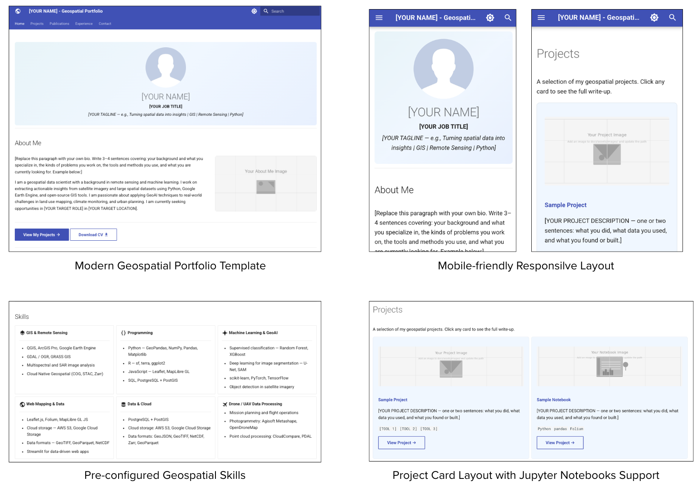

# Geospatial Portfolio Template

A ready-to-use portfolio website template for geospatial professionals — GIS analysts, remote
sensing specialists, spatial data scientists, and GeoAI practitioners. Built with
[MkDocs](https://www.mkdocs.org/) and the [Material theme](https://squidfunk.github.io/mkdocs-material/).

Build a fully responsive personalized portfolio website - no Git or coding expertise required.

**[LIVE PORTFOLIO](https://spatialthoughts.github.io/)**

This template is part of our [Building Your Geospatial Portfolio Website](https://courses.spatialthoughts.com/geospatial-portfolio-workshop.html) workshop. Visit the workshop page for step-by-step instructions.

## License

[MIT License](LICENSE)
