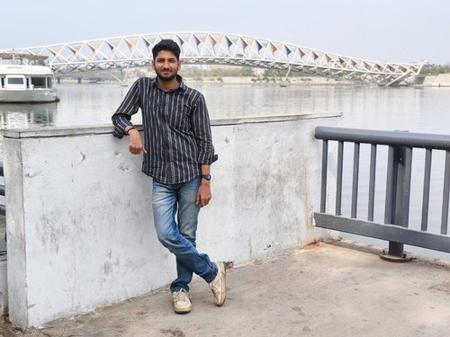

---
hide:
  - toc
  - navigation
---

  
  <h1>Warish Hussain</h1>
  
<strong>Environmental Analyst</strong>

  
<em>Turning climate & spatial data into insights | GIS | Remote Sensing | ESG | Sustainability | Climate Risk</em>

---

## About Me

I am an environmental professional with a background in environmental science, sustainability, and geospatial analysis. I work on understanding climate and environmental challenges through GIS, remote sensing, and climate data analysis, with interests spanning climate risk assessment, urban ecology, heat stress, and nature-based solutions. I use tools and methods including Python, GIS, remote sensing, climate datasets such as ERA5 and CMIP, and sustainability frameworks to support data-driven environmental decision-making. I am currently seeking opportunities in Climate Risk Analysis, GIS and Geospatial Analytics, Sustainability Consulting, and Environmental Data Analysis in Delhi-NCR or remote roles.

  

---

[View My Projects :material-arrow-right:](projects/index.md){ .md-button .md-button--primary }
[Download CV :material-download:](assets/Warish_CV.pdf){ .md-button }

---

## Skills

- :material-layers:{ .lg .middle } **GIS & Geospatial Analysis**

    ---

    - QGIS, ArcGIS Pro
    - Spatial analysis and geoprocessing
    - Cartography and map visualization
    - Geospatial data management and analysis

- :material-satellite-variant:{ .lg .middle } **Remote Sensing & Earth Observation**

    ---

    - Google Earth Engine
    - Satellite data processing and analysis
    - Land use and land cover analysis
    - Environmental and urban monitoring

- :material-code-braces:{ .lg .middle } **Programming & Data Analysis**

    ---

    - Python
    - Pandas, NumPy, Matplotlib
    - Jupyter Notebook
    - Data cleaning, visualization, and analysis

- :material-weather-sunny-alert:{ .lg .middle } **Climate Data & Risk Assessment**

    ---

    - ERA5 reanalysis datasets
    - CMIP climate model datasets
    - Heat stress and climate vulnerability analysis
    - Climate risk and resilience assessment

- :material-leaf:{ .lg .middle } **Sustainability & ESG**

    ---

    - ESG reporting frameworks (GRI, CDP, TCFD, BRSR, SBTi)
    - GHG inventory and emissions accounting
    - Water risk assessments
    - Sustainability reporting and disclosure

- :material-city:{ .lg .middle } **Environmental Applications**

    ---

    - Urban ecology and climate resilience
    - Nature-based Solutions (NbS)
    - Environmental impact assessment support
    - Spatial decision support for sustainability

---

## Connect

[GitHub](https://github.com/warish6798){ .md-button }
[LinkedIn](https://www.linkedin.com/in/warish-hussain-4b1b41228){ .md-button }
[ResearchGate](https://www.researchgate.net/profile/Warish-Hussain-2){ .md-button }