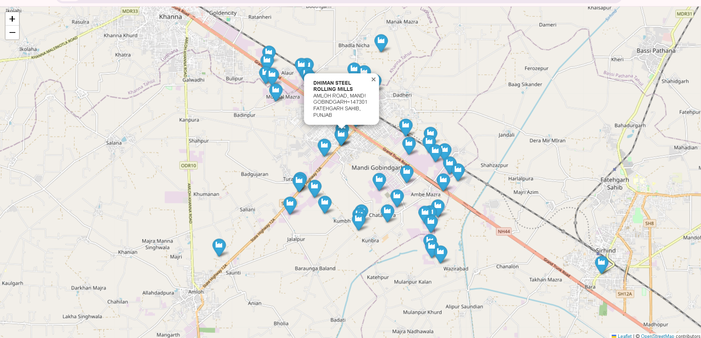
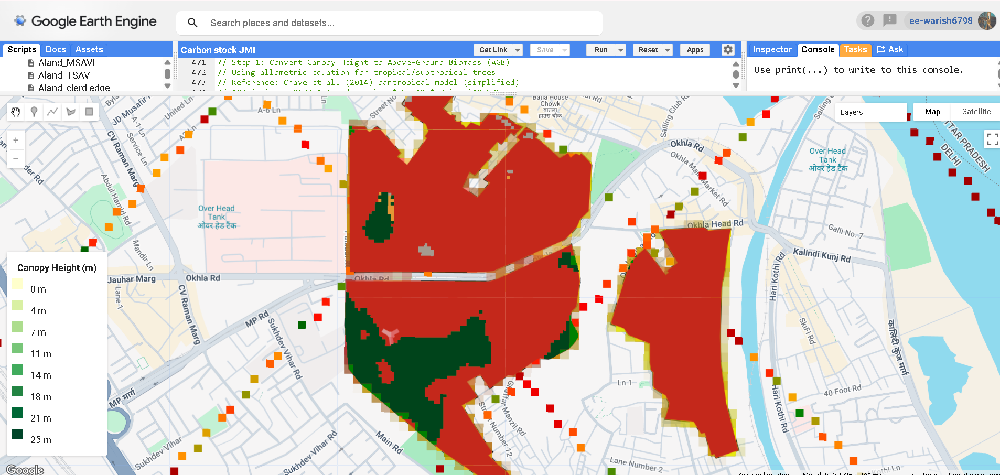

---
hide:
  - toc
  - navigation
---

# Projects

A selection of my geospatial and environmental projects. Click any card to see the full write-up.

**[Industrial Plant Location Mapping — Jammu & Kashmir](plant-location-map.md)**

An interactive web map visualizing industrial plant locations across Jammu & Kashmir,
built using Python, Leafmap, and Folium with OpenStreetMap base tiles and clickable popups.

`Python` `Leafmap` `Folium` `OpenStreetMap`

[View Project →](plant-location-map.md){ .md-button }

**[Carbon Stock Mapping — JMI Campus](carbon-stock-mapping.md)**

Machine learning-based carbon stock estimation for Jamia Millia Islamia campus using
Sentinel-1 SAR, Sentinel-2 optical imagery, GEDI LiDAR, and Random Forest regression
in Google Earth Engine.

`Google Earth Engine` `Sentinel-1` `Sentinel-2` `Random Forest` `GEDI`

[View Project →](carbon-stock-mapping.md){ .md-button }

